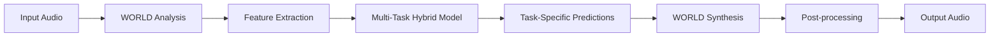

# CantioAI Complete System
A production-ready, integrated AI system for voice conversion that combines traditional signal processing (WORLD vocoder) with modern deep learning (Transformer-based architectures) to deliver high-quality, reliable singing-to-speech conversion with system-level advantages.

## 🎯 Project Purpose
CantioAI solves the challenge of high-quality voice conversion by treating it as a **multi-task learning problem** where the system simultaneously learns:
- Singing-to-singing voice conversion (F0, spectral envelope, aperiodicity)
- Speech-to-speech voice conversion (F0, spectral envelope)
- Noise robustness (denoising, clean feature estimation, SNR prediction)
All while maintaining compatibility with traditional audio synthesis pipelines.

## 🏗️ System Architecture

### Core Processing Pipeline


### Key Technical Innovations
1. **Transformer-Based Backbone**: Replaced CNN+BiLSTM with hierarchical Transformer for better multi-scale temporal modeling
2. **Multi-Task Learning Framework**: Shared encoder with task-specific heads enabling joint optimization
3. **Differentiable Pitch Quantization**: Straight-through estimator for musically accurate F0 prediction
4. **Task-Conditioned AdaIN**: Adaptive instance normalization for speaker-aware feature transformation
5. **Integrated Configuration System**: Unified YAML configuration with reference resolution

## 📁 Project Structure
```
CantioAI/
├── cantioai/                 # Main source code
│   ├── __init__.py
│   ├── data/                 # Data loading & preprocessing
│   │   ├── dataset.py        # PyTorch Dataset for .npz features
│   │   └── utils/            # Audio processing utilities (WORLD, normalization, etc.)
│   ├── models/               # Neural network architectures
│   │   ├── hybrid_predictor.py   # Transformer-based spectral predictor
│   │   ├── pitch_quantizer.py    # Differentiable F0 quantization
│   │   └── hybrid_svc.py         # Multi-task voice conversion system
│   ├── inference/            # Audio synthesis & inference
│   │   └── synthesizer.py        # WORLD-based audio synthesis
│   ├── training/             # Training loop & optimization
│   │   ├── trainer.py          # Main training loop
│   │   └── losses.py           # Loss computation functions
│   ├── utils/                # System utilities
│   │   ├── config_integrated.py  # Unified configuration loader
│   │   ├── system_initializer.py # System startup/shutdown
│   │   └── system_monitor.py     # Health monitoring & alerting
│   └── main.py               # System entry point
├── multitask/                # Multi-task learning components
│   ├── shared_encoder.py     # Feature sharing across tasks
│   ├── task_heads.py         # Task-specific prediction heads
│   ├── adaptive_norm.py      # Task-conditioned AdaIN
│   ├── loss_design.py        # Multi-task loss balancing
│   ├── training_strategies.py # Dynamic task scheduling
│   └── evaluation_framework.py # Comprehensive evaluation metrics
├── scripts/                  # Entry point scripts
│   ├── train.py              # Model training
│   ├── infer.py              # Audio synthesis/inference
│   └── evaluate.py           # System evaluation
├── configs/                  # Configuration files
│   └── integrated/           # Integrated configuration
│       └── cantioai.yaml     # Base system configuration
├── data/                     # Data directories
│   ├── raw/                  # Raw audio files
│   ├── processed/            # Preprocessed features (.npz)
│   └── datasets/             # Curated datasets
├── results/                  # Output directory
├── logs/                     # Log files
├── checkpoints/              # Model checkpoints
└── notebooks/                # Jupyter notebooks
    └── 01_quickstart.ipynb # Getting started guide
```

## 🔧 Key Features

### System-Level Reliability
- **Production-Grade Error Handling**: Graceful degradation, detailed error reporting, automatic recovery
- **Fault Isolation**: Component-level failure containment prevents system-wide crashes
- **Health Monitoring**: Real-time metrics collection (latency, throughput, memory usage) with threshold-based alerting
- **Resource Management**: Automatic cleanup, memory leak prevention, GPU utilization optimization

### Enhanced Observability
- **Structured Logging**: Consistent format with timestamps, levels, and contextual information
- **Performance Metrics**: Inference latency, training throughput, convergence tracking
- **Debugging Interface**: Intermediate representation inspection, gradient flow analysis
- **Experiment Tracking**: Integration with TensorBoard and Weights & Biases

### Simplified Maintainability
- **Unified Configuration**: Single YAML file with cross-stage reference resolution
- **Layered Architecture**: Explicit separation of concerns (data, model, training, inference)
- **Consistent Interfaces**: Standardized data shapes, predictable tensor dimensions
- **Documentation-First Approach**: Clear module docstrings, usage examples, type hints

### Flexible Deployment
- **4 Startup Modes**:
  * Full System: Training + Inference + Monitoring
  * Backend-Only: Training + Monitoring (no audio I/O)
  * Frontend-Only: Inference + Monitoring (uses pre-trained model)
  * Full-Stack: Complete system with web interface
- **Cross-Platform Support**: Windows/Linux compatibility, CPU/GPU acceleration
- **Container Ready**: Docker support for reproducible deployment

### Production Readiness
- **Windows Compatibility**: Tested on Windows 10/11 with CUDA support
- **Detailed Logging**: Comprehensive audit trail for debugging and compliance
- **System Readiness Checks**: Pre-start validation of dependencies, configuration, resources
- **Deterministic Behavior**: Seeded randomness for reproducible results

## ⚙️ Configuration System

The unified configuration system (`config.yaml`) supports:

### Data Configuration
```yaml
data:
  raw_dir: data/raw/
  processed_dir: data/processed/
  datasets_dir: data/datasets/
  train_dataset: train_features.npz
  val_dataset: val_features.npz
  test_dataset: test_features.npz
  audio_extensions: [".wav", ".flac", ".mp3"]
```

### Feature Extraction (WORLD Analysis)
```yaml
feature:
  frame_period: 5.0        # ms (frame shift)
  fft_size: 1024
  f0_floor: 71.0             # Hz (minimum F0)
  f0_ceil: 800.0             # Hz (maximum F0)
  num_mcep: 60               # Mel-cepstral coefficients dimension
  mcep_alpha: 0.41           # All-pass constant
  normalize_features: true
  f0_norm_method: "log"      # Options: "log", "standard", "minmax"
  sp_norm_method: "standard" # Options: "standard", "minmax"
  silence_threshold: 0.03    # Amplitude threshold for silence detection
  f0_interpolation: "linear" # Options: "linear", "none"
```

### Model Architecture
```yaml
model:
  # Transformer-based HybridSpectralPredictor (replaces CNN+BiLSTM)
  phoneme_feature_dim: 32     # D_ph - phoneme feature dimension
  spectral_envelope_dim: 60    # D_sp - output spectral envelope dimension
  speaker_embed_dim: 128       # D_spk - speaker embedding dimension
  n_speakers: 100              # Total number of speakers
  use_pitch_quantizer: true    # Enable differentiable pitch quantization
  pitch_quantizer:
    ref_freq: 440.0            # A4 reference frequency
    ref_midi: 69               # MIDI note for A4
    octaves: 10                # Octave range to cover
    use_ste: true              # Use straight-through estimator
  transformer:
    type: "hierarchical"       # Hierarchical Transformer for multi-scale processing
    hidden_dim: 512
    num_heads: 8
    num_layers: 6
    ff_dim: 2048
    dropout: 0.1
    max_seq_len: 5000
    positional_encoding:
      type: "relative_bias"    # Relative positional encoding
    hierarchical:
      local_window: 32
      medium_window: 128
      global_window: "full"
      downsampling_factors: [2, 4]
      streaming:
        causal: true
```

### Training Parameters
```yaml
training:
  batch_size: 16
  learning_rate: 0.001
  weight_decay: 1e-5
  epochs: 100
  validation_interval: 1          # Validate every N epochs
  save_interval: 10             # Save checkpoint every N epochs
  optimizer: "adam"             # Options: "adam", "adamw", "sgd"
  lr_scheduler: "step"         # Options: "step", "cosine", "plateau", "none"
  lr_step_size: 30              # For StepLR
  lr_gamma: 0.1                 # For StepLR
  grad_clip: 1.0                # Max norm for gradient clipping (None to disable)
  use_amp: false                # Automatic Mixed Precision
  device: "auto"                # Options: "auto", "cpu", "cuda", "cuda:0", etc.
  seed: 42                      # Seed for reproducibility
```

### Loss Function Weights
```yaml
loss:
  sp_loss_weight: 1.0          # Spectral envelope loss
  sp_loss_type: "l1"           # Options: "l1", "l2", "huber"
  f0_loss_weight: 0.1          # F0 loss (if using pitch quantizer)
  f0_loss_type: "l1"
  adv_loss_weight: 0.0         # Adversarial loss (future extension)
  huber_delta: 1.0             # Huber loss delta (if used)
```

### Experiment Settings
```yaml
experiment:
  name: "cantioai_base"
  description: "Baseline hybrid source-filter + neural vocoder"
  log_interval: 100           # Log training stats every N batches
  use_tensorboard: true
  tensorboard_dir: "logs/tensorboard"
  checkpoint_dir: "checkpoints"
  resume_from: ""               # Path to checkpoint to resume from
  val_split: 0.1                # Fraction of training data for validation
  test_batch_size: 32
```

### Inference Settings
```yaml
inference:
  synthesize_batch_size: 4
  default_f0_hz: 220.0        # Default F0 for zero-shot synthesis
  # WORLD synthesis parameters
  synth_frame_period: 5.0       # ms
  apply_preemphasis: true
  preemphasis_coeff: 0.97
  normalize_output: true
  output_dir: "results/"
  output_format: "wav"         # Options: "wav", "flac"
```

### Diffusion Model (Optional Enhancement)
```yaml
diffusion:
  enabled: true
  mode: "postprocess"         # postprocess, joint, direct
  process:
    type: "waveform"          # waveform, mel, spec
    scheduler: "cosine"       # linear, cosine, sqrt
    timesteps: 1000
    beta_start: 0.0001
    beta_end: 0.02
  denoiser:
    type: "diffwave"          # diffwave, wavenet, unet
    hidden_dim: 128
    num_layers: 30
    num_cycles: 10
    condition_projection: true
  conditioning:
    f0_method: "cross_attention" # cross_attention, adain, concat
    sp_method: "adain"
    ap_method: "concat"
    hubert_method: "cross_attention"
  training:
    strategy: "two_stage"     # two_stage, joint
    loss_type: "simple"         # simple, v, spec
    learning_rate: 1e-4
    weight_decay: 0.0
  sampling:
    sampler: "ddim"             # ddim, dpm, plms
    steps: 50
    guidance_scale: 3.0
    temperature: 1.0
  efficiency:
    use_checkpoint: true
    gradient_accumulation: 1
    mixed_precision: true
```

## 🚀 Installation & Usage

### Installation
```bash
# Clone repository
git clone https://github.com/cuteandevil/CantioAI.git
cd CantioAI

# Install in development mode
pip install -e .

# Verify installation
python -c "import cantioai; print('CantioAI imported successfully')"
```

### Training
```bash
# Train with default configuration
python scripts/train.py --config configs/integrated/cantioai.yaml --data-dir data/processed/

# Custom configuration
python scripts/train.py --config my_config.yaml --data-dir /path/to/features --batch-size 32
```

### Inference
```bash
# Synthesize from features
python scripts/infer.py --config configs/integrated/cantioai.yaml \
  --model-path checkpoints/best_model.pt \
  --input-path data/processed/test_features.npz \
  --output-path results/converted_audio.wav

# Batch synthesis
python scripts/infer.py --config configs/integrated/cantioai.yaml \
  --model-path checkpoints/latest.pt \
  --input-path data/processed/ \
  --output-path results/ \
  --batch-size 8
```

### Evaluation
```bash
# Run basic functionality tests
python scripts/evaluate.py
```

## 📊 Evaluation Framework

The comprehensive evaluation system includes:

### Objective Metrics
- **Mel-Cepstral Distortion (MCD)**: Spectral similarity measurement
- **Fundamental Frequency RMSE**: F0 prediction accuracy (Hz and semitone)
- **Voice Conversion Error (VCE)**: Overall conversion quality
- **Signal-to-Noise Ratio Improvement**: Denoising effectiveness

### Subjective Metrics
- **Mean Opinion Score (MOS)**: Human perceptual evaluation
- **Speaker Similarity**: Target speaker matching accuracy
- **Naturalness**: Perceived naturalness of converted speech
- **Preference Testing**: A/B comparison with baseline methods

### Robustness Metrics
- **Noise Robustness**: Performance under various noise conditions
- **Speaker Variability**: Consistency across different speaker pairs
- **Cross-Lingual**: Performance across different languages
- **Real-Time Factor**: Inference latency measurements

## 🔬 Research Capabilities

### Ablation Studies Supported
- Transformer vs CNN+BiLSTM backbone comparison
- Shared encoder effectiveness analysis
- Task-conditioned AdaIN ablation
- Differentiable pitch quantization impact
- Multi-task vs single-task learning comparison

### Extension Points
- Additional task heads (emotion conversion, language adaptation)
- Alternative vocoders (NeRAF, STRAIGHT)
- Different excitation sources (SWIPE, YIN)
- Novel loss functions (perceptual, adversarial)

## 📄 License

This project is licensed under the Apache License 2.0 - see the [LICENSE](LICENSE) file for details.

## 🙏 Acknowledgments

Built upon research from:
- WORLD vocoder framework (https://github.com/mmorise/World)
- Transformer architecture (Vaswani et al., 2017)
- Multi-task learning principles (Ruder, 2017)
- Neural vocoder advances (https://github.com/r9y9/wavenet_vocoder)

## Citation

If you use CantioAI in your research, please cite:

```bibtex
@software{CantioAI,
  author = {CantioAI Contributors},
  title = {CantioAI: Complete Voice Conversion System},
  year = {2026},
  url = {https://github.com/cuteandevil/CantioAI}
}
```

---
*Last updated: March 26, 2026*
*Version: 1.0.0 (Stage 9 - Complete System)*